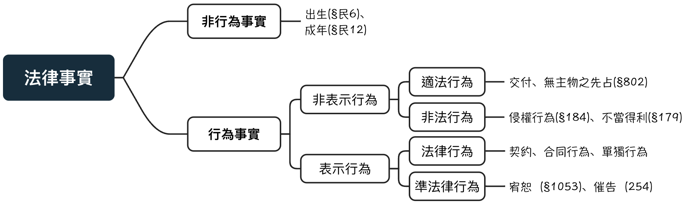

<link href="https://fonts.googleapis.com/icon?family=Material+Icons" rel="stylesheet">

# 何為權利變動

- 定義：基於一定的法律事實，產生權利得喪變更的法律效果

- 特性：債權、物權為主

- 基本原則：私法自治、契約自由

- 意思：形成法律關係:

  + 基於當事人之意思形成其關係：契約(私法自治)
  
  + 非，由法律擬制(偏離原則)

## 案例：ㄧ物二賣

甲與乙依民§345將持有之房屋賣與乙，而後又與丙締結買賣契約

1、甲乙間約定效果為何？

2、誰是不動產的所有權人？

### 債權之契約：民§345

> 1.稱買賣者，謂當事人約定一方移轉財產權於他方，他方支付價金之契約。
 當事人就標的物及其價金互相同意時，買賣契約即為成立。

是一種雙物契約
負擔行為、債權行為
甲移轉財產權給乙＝乙向甲請求轉移
乙支負債金＝甲向乙請求價金

雙方藉由意思表示(締結契約：債權行為)而由民§345之法律效果產生兩個債權

債權行為不會產生其他法律效果(物權變動)

### 物權之契約：[民§761-1](https://law.moj.gov.tw/LawClass/LawSingle.aspx?pcode=B0000001&flno=761)

> 1.動產物權之讓與，非將動產<mark>交付</mark>，不生效力。但受讓人已占有動產者，於讓與合意時，即生效力。

- 讓與合意(對物權之變動達成合議)：基於雙方之意思而產生之法律效果=>物權行為，而非行成債權
物權之讓與合意也是契約，此契約產生物之權利之變動

- 交付(標的物之所有權)
不以意思作為要素，而是客觀之事實，法律擬制其效果
換句話說，交付之意思有無、背後原因為何，不影響交付之發生

### 結論：

1.甲與乙、丙買賣契約僅限與債權債務之產生，不會產生物權(所有權)之變動

2.物權之變動必須有物權行為(契約)並且有法定方法，因此房屋之物權仍為甲所有

## 法律事實

{width="80%"}

### 法律事實之分類

- 法律事實：
定義：能夠與權利與義務相關聯的事實
反例：睡覺、吃飯

- 行為與非行為事實

  + 行為事實：經由人的行為所發生者
  
  + 非行為事實：非經由人的行為所發生者 
  例：出生(§民6)、成年(§民12)

- 適法行為：
   
  + 法律行為：以**意思表示**為主體，透過將意思表露於外，法律之規定賦予相符合之法律效果 
  最典型的契約，另有單獨行為(例：遺囑)、合同行為(例：創立社團法人)
  契約又可分為1.債務契約 2.物權契約

  + 準法律行為：**意思通知、觀念通知、感情表示** 
  得類推適用法律行為之規定(例：得有漏洞之填補) 
  例：催告（254, 無須針對金額有所認識）、觀念通知（股東會召集）、宥恕（§1053;原諒=>喪失請求權)

- 事實行為(法定之債)：基於事實上的行為而**非以意思或精神表示**為要素 
  無涉及行為人內心意思表示，與法律行為類型不同，無類推適用 
  
  + 適法行為：無主物之先占(§802)，埋藏物之發現(§808)
  
  + 非法行為：侵權行為(§184)、不當得利(§179)

## 法律行為

- 物權與債權行為之分類

  + 負擔行為：發生債權債務為其內容的法律行為，亦稱「債權行為」  
  
  + 處分行為：直接使權利發生、變更或消滅的行為，包含「物權行為」與「準物權行為」 
  
    + 物權行為：發生物權法上效果之行為，如物權之讓與合意（物權契約） 
    
    + 準物權行為：使物權以外之權利發生、變更或消滅之行為。如債務免除、債權讓與、股份讓與