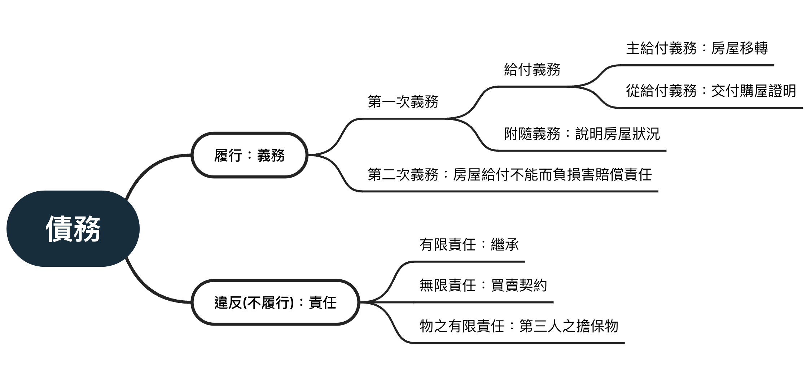

# 債之概論

## 債之一般原理

1.契約自由：

除有違反法律強行或禁止規定外(§71~73)

2.任意性

基於私法自治，除上述重大違反公眾利益的行為，原則上債法屬於**補充地位**，適用於當事人未特別約定。

即使債法第二章已預先對買賣、借貸、等典型權利義務有預先規定，但當事人仍得以**約定排除適用**。

3.相對性

債權無**對世性**，屬於**相對性**的權利。因此一債務人無法向其債務人主張其債權。

另外，債權是平等的，並且可以並存。如上學期提及之ㄧ物二賣，兩契約平等，不論時間先後。未獲物權之債權人僅得以債務不履行(§226)。

## 債權實現

債務人以**請求**(權)作為實現債之**手段**，而債務人以**作為**或**不作為**的方式給付(§199)。

當債權失去了請求的作用，債的實現效果減弱，如罹於時效的債權。

債務人無法給付，則進入**債務不履行**的效果(225、226)

在未有特別處分的情下，債權人得已以**債權處分**使債權**直接**滿足，如讓與、抵銷

除法律有特別規定外(§151、334)，債權人不得以私力實現債權，必須具備請求力與**執行力**，若無法執行，債權難以強制獲償。

除以請求與執行保障債權人之權利得以實現，債權人也有**持有力**，是保有利益之法律上原因，否則為**不當得利**(§179)

>民法199：給付 
I：債權人基於債之關係，得向債務人請求給付。 
II：給付，不以有財產價格者為限。 
III：不作為亦得為給付。

## 相對性之例外

雖然債權原則上是相對性的，但在某些情況，債權會賦予對抗**第三人**之效力。這種讓債權擁有對世性的特性，稱**物權債權化**。

### 買賣不破租賃

承租人交付訂金，換取房子之使用權，此契約當然賦予的是**債權**，承租人僅對房東主張其權利。但若房屋將房子賣與第三人，在具備一定之法定要件，承租人得要求**租賃契約繼續存在**，使其繼承出租人地位，不得請求其返還租賃物。

>民法425：買賣不破租賃 
I：出租人於租賃物交付後，承租人占有中，縱將其所有權讓與第三人，其租賃契約，對於受讓人仍繼續存在。 
II：前項規定，於未經公證之不動產租賃契約，其期限逾五年或未定期限者，不適用之。

### 優先承買權

民法§426-II規定，在租地建屋(出租人擁有土地、租地者擁有房屋所有權)的特殊情形下，若出租人欲賣屋基地時，房屋所有人得主張**優先承購權**，反之亦然。縱使不動產所有權賣出於第三人，且已完成所有權登記，仍可以主張優先承購權**對抗第三人**。在土地法與農地重劃條例也有相關規定。

>民法426：優先承買權 
I：租用基地建築房屋，出租人出賣基地時，承租人有依同樣條件優先承買之權。承租人出賣房屋時，基地所有人有依同樣條件優先承買之權。 
II：前項情形，出賣人應將出賣條件以書面通知優先承買權人。優先承買權人於通知達到後十日內未以書面表示承買者，視為放棄。 
III：出賣人未以書面通知優先承買權人而為所有權之移轉登記者，不得對抗優先承買權人。

## 債之義務

{width=100%}

 
### 積極義務與消極義務

積極義務指**作為**，例如簽訂房屋買賣之賣家有移轉房屋所有權之作為義務。

消極義務指**不作為**，如容忍他人通行其土地之義務(§787)。

通常積極義務之違反就是不履行，換言之就是不作為，反之亦然。

### 第一次與第二次給付義務

第一次給付義務指債權人**請求之內容**，第二次給付義務是**第一次給付義務無法實現**而出現之替代義務。

以買賣房屋為例，出賣人第一次給付義務就是移轉房屋所有權，第二次給付義務出現在當出賣人無法移轉房屋所有權(例：出賣於他人)，買受人得請求出賣人負起**損害賠償責任**(§226 I)

### 主給付義務、從給付義務與附隨義務

主給付義務就是**債存在之原因**，如買賣房屋之房屋所有權移轉。

從給付義務是為了**主給付義務圓滿實現**而出現，如交付房屋相關資料。

從給付義務得以藉由訴訟請求其屢行，並申請強制執行。債權人不得已從給付義務不履行主張同時履行抗辯權，但也有因保護交易安全出現之例外。如民法324，

從給付義務之消滅時效開始、進行、障礙及消滅，都隨著主給付義務一起。即使從給付義務尚未開始，主給付義務消滅，從給付義務也隨之消滅。

附隨義務同樣是為了完成主給付義務而生，與從給付義務不相同之處在於附隨義務**不得以訴訟請求**履行，若債務人違反時，可請求**損害賠償**，債務人應負227第一項**不完全給付**之債務不履行責任。

受雇人服勞務，其生命、身體、健康有危害之虞者，雇用人有「必要之預防」義務(§483 -1)，這是**從給付義務**不是附隨義務，在家中有危險之設備，雇用者得請求受雇人移除危險，而非在事後請求損害賠償。

### 後契約與先契約

原則上債之關係限定於契約之內，但在特殊情況(法條)規定下，相對人必須負某些**注意義務**，避免他方之不利益。

常見的情況在兩公司合作，在簽約之前的交流，在締約時應使其負有保守秘密之**先契約義務**，當某方違反時應為**締約之過失**(§245之1)

>民法245之1：契約消滅後之義務 
契約未成立時，當事人為準備或商議訂立契約而有左列情形之一者，對於非因過失而信契約能成立致受損害之他方當事人，負賠償責任： 
一、就訂約有重要關係之事項，對他方之詢問，惡意隱匿或為不實之說明者。 
二、知悉或持有他方之秘密，經他方明示應予保密，而因故意或重大過失洩漏之者。 
三、其他顯然違反誠實及信用方法者。 
前項損害賠償請求權，因二年間不行使而消滅。

另外一種如雇用契約訂有「離職後特定期間內，不得受雇從事相同職務內容之工作。」負有這種義務的勞工在契約結束後(離職)仍應負有**保密義務**，這是**後契約義務**。

### 不真正義務

不真正義務又稱**對己義務**，相對人無請求履行之權利，違反之人不需要負損害賠償責任，蛋會產生不利益。如車禍事故中，受傷者故意延誤就醫，導致傷勢加重。加害者得主張乃傷者對傷害之擴大亦有過失，應自己承擔損害之不利益。(§§217、262、356I)

>民法§217： 
I：損害之發生或擴大，被害人與有過失者，法院得減輕賠償金額，或免除之。 
II：重大之損害原因，為債務人所不及知，而被害人不預促其注意或怠於避免或減少損害者，為與有過失。 
III：前二項之規定，於被害人之代理人或使用人與有過失者，準用之。

### 責任

債物之不履行，通常均有責任產生。原則上債務人須以**全部財產**對債權人負責，所謂**完全責任**。

例外的情況，行為人只需以特定財產對債權人負責，稱**有限責任**。如繼承人僅需以繼承所得財產為限，負清償責任(§1148)。

當第三人以其特定財產供債權人社並抵押權等擔保權，以擔保債務人之債務。此時第三人**非債務人**，債權人對該第三人(物上保證人)，僅就該供擔保之特定財產受清償，此即**物之有限責任**。

### 自然債務

債務若已**失去請求作用**，債務人對債權人之請求履行得為抗辯者，即**自然債務**。如罹於時效之債務，若債務人拒絕履行，請求權消滅；若債務人主動履行，不得以不當得利返還所為給付(§144)。另外婚姻之約定報酬(§573)，該約定雖為有效，但無請求權之適用，且給付後不得請求返還。賭債屬於較有爭議之自然債務，部分實務肯認，但不部分認為其本身為不法行為，根本無債務，自然非自然債務。至於債務人給付後，亦不得依不得利，請求債權人返還所為給付(§180第4項)

>民法§144：罹於時效的自然債務 
I：時效完成後，債務人得拒絕給付。 
II：請求權已經時效消滅，債務人仍為履行之給付者，不得以不知時效為理由，請求返還；其以契約承認該債務或提出擔保者亦同。

>民法573：婚姻之約定報酬無請求權 
因婚姻居間而約定報酬者，就其報酬無請求權。

>民法180-4：不得請求返還狀況 
給付，有左列情形之一者，不得請求返還： 
一、給付係履行道德上之義務者。 
二、債務人於未到期之債務因清償而為給付者。 
三、因清償債務而為給付，於給付時明知無給付之義務者。 
四、因不法之原因而為給付者。但不法之原因僅於受領人一方存在時，不在此限。

## 請求權基礎-類型

新式民法分析導入德國之請求權概念，口訣是契、類、無、物、不、侵。以下我們大致介紹各種請求權之基礎。

### 契約上之請權

因**契約**所生之請求權，類型最多元。最典型的即為因**債務不履行**所生之請求權，如債務人因給付不能所產生之損害賠償請求權(§226 I)。

以上述為例，若欲主張此種權利，需先確認 
債之關係是否成立？要約及承諾是否合制? 
法律行為之一般生效要件是否具備?(行為能力、意思表示) 

再來，就不能給付之概念進行檢驗(§246不能概念?、§200種類之債?)

最後，可歸責之事由(§220過失之概念、單、雙務契約)判斷

### 類似契約上之請求權

此種契約之產生，乃在**契約關係不生效之情況下**，當事人依據法律規定所發生之請求權，如無權代理所生之損害賠償請求權(§110)，需就代理之概念(§104～)、代理權之授予(§167)等進行檢驗。其他如錯誤之撤銷所生之損害賠償請求權(§91)、因自始給付不能所生之損害賠償(§247)均屬之。

### 無因管理請求權

無因管理：**未受委任且無義務**，而為他人管理事務(§172)，屬法定管理他人事務權限。

當管理人欲依民法176條第1項之規定，請求他人償還所支出之費用、清償債務以及損害賠償，須具備**管理行為、管理人之管理意思、未受委任並無義務之構成要件**

### 物上請求權

所有權人行使物上請求權，請求返還佔有物，乃依民法767第一項。其中所有權人涉及所有權變動之法律關係，佔有人則涉及佔有權之判斷。

>民法767：物上請求權 
I：所有人對於無權占有或侵奪其所有物者，得請求返還之。對於妨害其所有權者，得請求除去之。有妨害其所有權之虞者，得請求防止之。 
II：前項規定，於所有權以外之物權，準用之。

### 不當得利請求權

不當得利依據民法第179條之規定，必須ㄧ方受利、ㄧ方受損，存在因果關係而無法律上之原因

>民法179：不當得利之返還 
無法律上之原因而受利益，致他人受損害者，應返還其利益。雖有法律上之原因，而其後已不存在者，亦同。

### 侵權行為請求權

依民法184條第一項前段規定，當權利受到不法之損害，並且該損害與不法行為具備因果關係，並且考量故意、過失、責任能力做綜合判斷。

>民法§184：侵權行為之損害賠償 
I：因故意或過失，不法侵害他人之權利者，負損害賠償責任。故意以背於善良風俗之方法，加損害於他人者亦同。 
II：違反保護他人之法律，致生損害於他人者，負賠償責任。但能證明其行為無過失者，不在此限。

## 請求權基礎-實例演練

甲以3000圓之價格將腳踏車租與乙，租期一年，而乙卻在租期未滿3個月時將其以5000元售予丙，並交付之，請問當事人之間的法律關係為何?

(ㄧ)甲與丙

依提幹可知，甲與丙間未以任何方式訂下契約。於此，甲應依民法(下同)767條第一項請求返還其自租車。以下依所有物返還請求權之構成要件：(1)甲是否為自行車所有人(2)丙是否為無權佔有人

(1)甲不為自行車所有人

甲將自行車以租賃契約方式交付與乙，乙為直接佔有人，甲為間接佔有人，此時甲仍為自行車之所有人。而乙以非所有權人之身分與丙簽訂買賣契約，並交付之，其中買賣契約為負擔行為，不應乙為無權處分人而無效。另一方，乙所為交付行為，是為無權處分，依第118條第一項，在未得甲之承認前，屬效力未定。然，丙以該車所有權之目的，而善意受該讓該車之佔有，縱乙無讓與之權，善意之第三人丙仍受法律保護而獲該車之所有權，甲之所有權消滅。

(2)丙非為無權佔有人

丙因善意受讓而獲取自行車之所有權，善意取得乃其保有利益之法律原因，甲亦不得依179條不當得利之規定請求返還。

(3)結論

丙依善意取得自行車之所有權，非無權占有人。甲之所有權因此消滅，不為所有人，自不得依767條第一項請求返還。

(二)甲與乙

1.契約上請求權

甲與乙簽下為期一年之租賃契約，乙自應依契約返還該車，然因乙擅自讓與丙，屬可歸於乙之事由，無法返還，甲可就第226條第一項給付不能規定，對乙提出損害賠償請求。

2.不當得利請求權

乙與丙締結買賣之契約時，腳踏車之所有權人屬於甲，乙無任何原因獲取5000之價金，並且使甲蒙受失去腳踏車之損害，甲可依179不當得利之規定，請求返還所受利益。

3.侵權行為請求權

甲因乙之擅自轉賣而受失去所有權之損害，乃不法之侵害，甲自得依民法第184條第一項之規定，主張侵權行為之損害賠償。