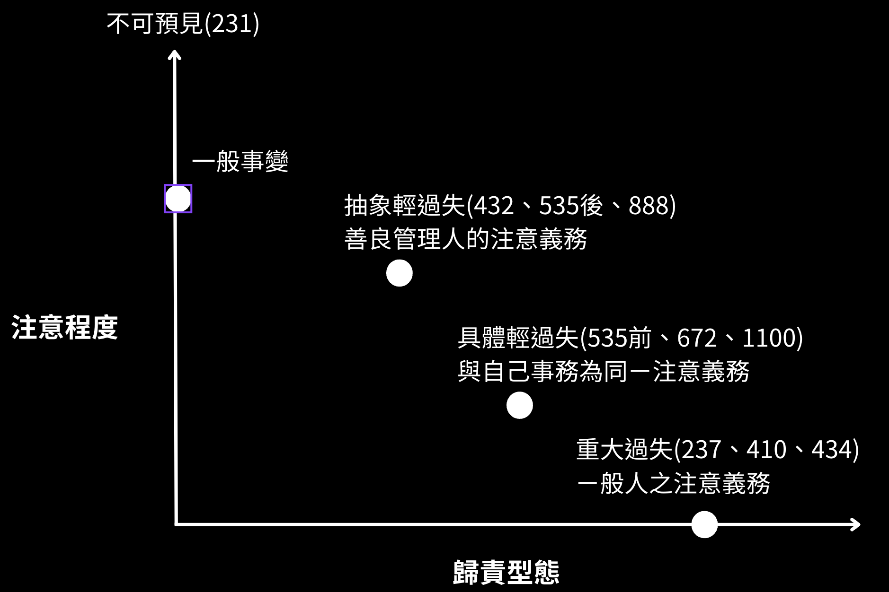
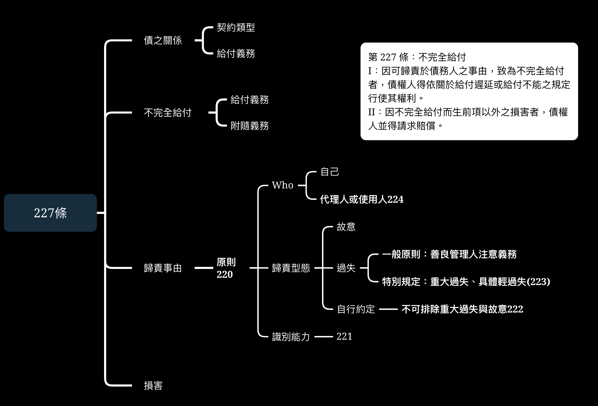
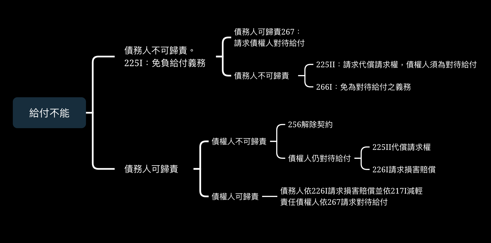
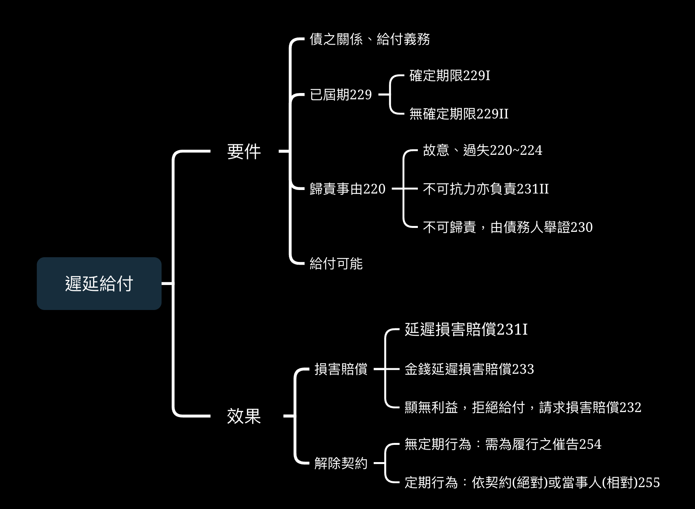

# 違約責任

違約，即債務人無法依其契約而為給付義務，§粗列分三種情況

- 給付不能：

- 不完全給付：己付具備瑕疵，如所交付之物受損

- 給付延遲：在**屆清償期未能提出給付**，如車商延期交車

## 歸責原則

歸責事由應為處理違約責任的第一步，我國民法常以「可歸責於債務人之事由」

民法第226第1項：「因**可歸責於債務人之事由**，致給付不能者，債權人得請求賠償損害。」、民法第227第1項：「因**可歸責於債務人之事由**，致為不完全給付者，債權人得依關於給付遲延或給付不能之規定行使其權利。」

而具體事由(違約樣態)為何，應就各契約之性質論，但可依循下列次序：

1.法律規定的一般原則

2.法律特別規定

3.當事人約定

## 過失責任

### 故意

故意，可以是直接故意，債務之不履行為債務明知並有意使其發生，或是間接故意，債務人能預見不履行的發生並且不違背其本意。

故意以認識其違法性為必要，無認識其違法性的債務人雖能排除故意，但仍就其誤認違法性而負過失責任。

故意屬於自由意志的嚴重濫用，民法以220明文規定不得已約定的方式排除故意責任。

>民法§220： 
故意或重大過失之責任，不得預先免除。

### 過失

{width=100%}

過失，是債務人能預見不履行的發生而確信其不會發生，或應注意得注意而不注意者。

民法的過失責任有輕重之分，前判例曰：「過失為注意之欠缺，民法上所謂過失，以其欠缺注意之程度為標準，可分為**抽象的過失**、**具體的過失**，及**重大過失**三種。

- 重大過失：欠缺**一般人應有的注意義務**

- 具體過失：依民法223條：「應**與處理自己事務為同一注意者**，如有重大過失，仍應負責」，民法535條規定處理委任事務者，與處理自己事務為同一之注意，就是具體過失。

- 抽象過失：未盡**善良管理人之注意義務**，此過失應在個案中綜合債務人的智識、職業等事務做衡量。535條後段，受有報酬者，應以善良管理人之注意為之，即為抽象過失。

>民法§535： 
受任人處理委任事務，應依委任人之指示，並與處理自己事務為同一之注意，其受有報酬者，應以善良管理人之注意為之。

## 無過失責任

債務人原則是僅就過失負責，但在特殊情況下，債務人無過失責任

### 不可抗力

民法231以不可抗力為特別規定，延遲給付者不得依此免除責任。

民法231規定：「債務人遲延者，債權人得請求其賠償因遲延而生之損害。前項債務人，在遲延中，對於因***不可抗力而生之損害**，亦應負責。但債務人證明縱不遲延給付，而仍不免發生損害者，不在此限。」

不可抗力因是與所謂「通常事變」相對，如天災，通常事變是一般可預見的事情。

更常見的是將不可抗力作為免除責任的條件，如§§606、607、634、654等等，但更重要的應是「規範通常事變責任」，如634運送人除了不可抗力或他方當事人之過失外，對於運送物品之毀損、喪失，應負責任。

>民法§634： 
運送人對於運送物之喪失、毀損或遲到，應負責任。但運送人能證明其喪失、毀損或遲到，係因不可抗力或因運送物之性質或因託運人或受貨人之過失而致者，不在此限。

## 歸責事由

前面所說之違約樣態，除法律有特別規定或當事人約定，應從一般原則：

### ㄧ般性原則

民法§220：「債務人就其故意或過失之行為，應負責任」，雖未明文，但應屬善良管理人的注意義務，也就是必須無輕過失。

### 法律特別規定

我國法律對違約責任之特別規定，通常是朝減輕債務人之注意義務：

- 贈與：民法§410：「贈與人僅就其故意或重大過失，對於受贈人負給付不能之責任。」

- 委任：民法§535：「受任人處理委任事務，應依委任人之指示，並**與處理自己事務為同一之注意**，其受有報酬者，應以**善良管理人之注意為之**。」

### 當事人約定

前面多次提及之222：「故意或重大過失之責任，不得預先免除。」可以反面解釋，當事人得以約定方式免除具體輕過失與抽象輕過失之責任。

而此當事人具備排除之權利，也受民法第72條(公序良俗)與第148條第2項(誠信原則)之限制。

## 履行輔助人責任

債務之履行透過他人進行，可以是前面章節所提到之代理人(§76)，或是僱傭關係中的使用人(§188)

民法224條規範代理人與使用人之責任：「債務人之代理人或使用人，關於債之履行有故意或過失時，債務人應與自己之故意或過失負同一責任。但當事人另有訂定者，不在此限。」

### 債之關係

224條之適用必是債務人與債權人之間有債之關係，如契約、契約過失、無因管理、侵權行為。反之，若債務人與債權人不具備債之關係，則不適用224條。

例：甲僱傭司機乙將A桌送往B處，不料在路上乙ㄧ時疏忽撞到丙。 
解：甲與丙間無債之關係，故不適用224條，而是188條之侵權行為。

另外，224條並不是獨立的請求權基礎，同樣以227為主，合以本條為輔。

### 輔助人

首先，代理人應通指法定代理人與意定代理人

使用人應以廣義理解，即凡事實上輔助債務人履行債務人均屬之，三項子原則輔助判斷

- 使用人必須**依債務人的意思履行債務**: 
店員將食物送到餐桌、司機依指示送達貨物

- **不以受債務人監督為必要**： 
出租人請水電行修繕房屋，不管是水電行(直接輔助人)或水電行的員工(間接輔助人)，都是使用人

- **履行債務之人**： 
即使存在雇用關係，但若行為本身不是履行債務，非此法所指之使用人 
甲冷氣公司與A簽訂冷氣購置合約(包含安裝): 
1：上門安裝之工人是履行債務之使用人，對工人安裝發生的瑕疵負不完全給付損害賠償責任 
2：甲之冷氣皆由乙公司製造，而製造冷氣本身不是履行債務

### 履行債務

是輔助人履行債務人對債權人之義務，不管是主給付義務、從給付義務或是附屬義務。如送貨之司機在運送過程中未注意讓商品消滅(給付不能)、未盡提醒運動器材使用說明的安裝人員(不完全給付)

### 故意與過失

故意與過失之判斷應參照前述，責任能力，應以輔助人的識別能力而定。

債務人不得預先排除自己的故意或過失責任，但可以排除輔助人之責任，直接自己就輔助人之故意或過失負責。

## 實例題

題：甲由乙營建公司承攬修繕屋頂及屋內天花板的工程，乙轉交丙水電商承包，丙使用其受僱 人丁施工。丁的施工不符一般工程基準，造成屋頂漏水，污損甲的牆壁及地毯。甲得否向乙請求損害賠償?

{width=150%}

甲之請求權基礎為民法(下同)第227條不完全給付請求損害賠償：

ㄧ、甲與乙之間具備承攬之契約關係，乙公司因而有修繕甲屋頂之義務

二、乙對甲之義務，除了依契約而生的修繕屋頂及屋內天花版，亦有保證該修繕工程不致使甲之利益與安全受損之附隨義務。受乙轉交承包之丙與丁既無完成完整之工程，甚而造成甲之財務受損，是為227條所指稱之不完給付。

三、220條明文規定：「債務人就其故意或過失之行為，應負責任。」就承攬人的歸責事由，法無明定，應遵從一般性規則，即須負善良管理人的注意義務。題幹之乙公司，就修繕不完整的狀況，並無故意或過失。然224條有明文：「債務人之代理人或使用人，關於債之履行有故意或過失時，債務人應與自己之故意或過失負同一責任。但當事人另有訂定者，不在此限。」應討論其所聘之雇用人是否具有過失，而乙是否以使用人之過失負同一責任。

1.甲與乙乃根據承攬契約而有債之關係。

2.雖丙與丁乃獨立承攬而不受監督，然224條所規定之使用人不以受債務人監督為必要，而丁之所為乃履行債務之行為。

3.履行之債務包含主給付義務，修繕房子，與附隨義務，使工程不致使甲受利益之損害

4.丁乃乙之使用人，其必須盡與乙相同的善良管理人注意義務。丁以其專業及能力，而疏於施工規則，而使主給付義務與附隨義務皆未能完成，是為有過失。

乙公司雖未有故意或過失，然其所聘用之丁有過失，依224條，乙與其使用人丁負同一責任而有可歸責事由。

四、甲得向乙依227條第1項與第2項規定請求屋頂漏水、牆壁、地毯污染的損害賠償

## 給付不能

### 自始不能、嗣後不能

自始不能是在契約成立前，債務人既已無法給付其債務 
例：在租車契約成立前，車輛(標的物)早已滅失

嗣後不能則是在契約成立後，債務人才失去給付其債務能力 
例：在租車契約成立後，車輛遭他人奪去並滅失

### 客觀不能、主觀不能

客觀不能是對任何人言，給付均屬不能
例：車輛被天災所毀

>民法§246：(自始客觀不能) 
I：以不能之給付為契約標的者，其契約為無效。但其不能情形可以除去，而當事人訂約時並預期於不能之情形除去後為給付者，其契約仍為有效。 
II：附停止條件或始期之契約，於條件成就或期限屆至前，不能之情形已除去者，其契約為有效。

主觀不能是債務人自己無法給付 
例：車輛為小偷所盜(小偷可以給付)、出賣他人之物，所有權人不願轉讓

### 物理不能、法律不能

物理不能是指依自然法則不能給付 
例：車輛燒毀(客觀)、醫師手受傷(主觀)

法律不能是給付義務牴觸法規 
例：賣毒品、建築執照被吊銷

### 事實不能、經濟不能、屬人性不能

事實不能是相對於物理不能，是顯失比例性的不能 
例：海底撈針、100萬搶救手機

經濟不能是指債務人在經濟上不能負擔 
例：原物料費用急遽上升，承包商無法負擔

屬人性不能是指債務人無法給付，但他人可以給付 

### 全部不能、部分不能

1.不可分給付：如ㄧ本書、ㄧ頭牛

2.可分給付：ㄧ套書、ㄧ袋蘋果

在通常情況下，如果是可分給付，則會是部分不能，如一系列書本丟失其一導致客觀不能，僅以該書為給付不能，而226II所規定「若其他部分之履行，於債權人無利益時，債權人得拒絕該部之給付，請求不履行之髓害賠償。」所謂不利益，以契約內容而視，如購買時以搜集整套為目的，即使僅部分丟失，債權人可以拒絕該部分之給付。

### 一時不能、永久不能

通常情況的不能都是指永久不能，在永久不能的情況下，行為人給付請求權會消滅 
例：車輛滅失、受雇人死亡

應處理的是何種一時不能可視為永久不能？

應以**契約目的而言，不可期待一方當事人可在誠實信用與利益衡量下，完成契約** 
例：約定交付車輛，但製造商的零件供應國發生戰爭，又該零件為專利品，廠商無法預期何時能交付車輛，此時應視為永久不能
 
- 絕對定期行為：契約之履行以ㄧ定時間為必要 
例：婚禮的司儀遭遇車禍，無法於當日參加，視為永久不能

- 相對定期行為：契約之履行有期限，但不具急迫性 
例：甲與乙約定在一個月交付車輛，若乙在一個月內未為給付，乙得定相當期間催告甲，若該期限內尚不履行，乙得解除契約。

>民法§254： 
契約當事人之一方遲延給付者，他方當事人得定相當期限催告其履行，如於期限內不履行時，得解除其契約。

## 給付不能：不可歸責於債務人事由

>民法§225： 
I：因不可歸責於債務人之事由，致給付不能者，債務人免給付義務。 
II：債務人因前項給付不能之事由，對第三人有損害賠償請求權者，債權人得向債務人請求讓與其損害賠償請求權，或交付其所受領之賠償物。

### 代償請求權

例：雙方約定交易地產，不料地產被政府徵收，該債權人得請求債務人交付其所獲之土地賠償金

值得注意，該代償請求權必需是債權人行使，債務人無法以己意代為行使。即該損賠償請求權移轉，當事人之間必須另有權利移轉行為。

該請求權移轉視為新債權，舊債權之擔保消滅，並且時效重新計算。

### 單務契約

單務契約中，因不可歸責於債務人之事由發生給付不能，債之關係消滅。 
例：贈與之標的物遭竊取，贈與人給付義務消滅。

### 雙務契約-不可歸責於他方當事人

266條：「因不可歸責於雙方當事人之事由，致一方之給付全部不能者，他方免為對待給付之義務。」，他方當事人亦因此免為對待給付。

若雙務契約之一方欲行使代償請求權，則**欲行使一方必為對代給付**，因代償請求權是代替原請求權。

### 雙務契約-可歸責為他方當事人

267條前項：「當事人之一方因可歸責於他方之事由，致不能給付者，得請求對待給付。」，不可歸責之債務人除可以免除給付義務，亦可請求對待給付。

又後項規定：「但其因免給付義務所得之利益或應得之利益，均應由其所得請求之對待給付中扣除之。」

- 所得之利益：如不履行給付義務所節省的成本、轉向他處所獲之利益

- 應得之利益：如拒絕他人之要約應得之利益

### 危險分擔

在不可歸責於雙方當事人事由，以至於給付不能，原則上以債務人(標的物所有權人)負責，債權人依225II有代償請求權。但買賣契約中，有兩條特別規定

373條：「買賣標的物之利益及危險，自交付時起，均由買受人承受負擔，但契約另有訂定者，不在此限。」

374條：「買受人請求將標的物送交清償地以外之處所者，自出賣人交付其標的物於為運送之人或承攬運送人時起，標的物之危險，由買受人負擔。」

例：賣家依契約出貨(交付)，但該貨運在半路上遭到竊取。 
賣家依225I不負給付義務，而賣家卻依373承擔危險，買家仍須依267為對待給付。 
但該標的物之所有權人仍為賣家(761必須有事實上的交付)，有損害賠償請求權 
出賣人僅得依225II請求代償請求權

## 給付不能：可歸責於債務人事由

{width=100%}

>民法§226： 
I：因可歸責於債務人之事由，致給付不能者，債權人得請求賠償損害。 
II：前項情形，給付一部不能者，若其他部分之履行，於債權人無利益時，債權人得拒絕該部之給付，請求全部不履行之損害賠償。

債權人於第一次給付義務，因可歸責事由，無法給付，而產生第二次給付義務，兩義務同屬於一個契約，故時效不重新起算。

### 損害賠償與代償請求權

例：甲與乙約定5/30號交付車輛，但甲在5/28號將車借給丙，不料丙將車撞毀(甲未盡監督而有過失)，此時之乙可主張何種權利？

依226條第1項，可歸責於債務人甲之事由，乙得請求損害賠償 
或類推225條第2項，第三人丙於甲約定全款買下車輛作為損害賠償，乙得請求甲讓與其損害賠償請求權。

### 雙務契約：不可歸責於他方當事人事由

應釐清的是，不管是代償請求權或是損害賠償，都是代替給付義務。

一方因對方之可歸責事由，而無法給付，ㄧ方必須為給付，才有損害賠償或代償請求權。 
於此，除了損害賠償或代償請求權，亦可依256條請求解除契約。

例：甲以遠超於市價的錢向乙收購A車，然而該車交付前被丙損毀，乙丙雙方答應以市價賠償該車。

相較於依226I要求損害賠償(市價)或225II要求代償請求權(市價)，甲不如依256條解除契約。

>民法§256： 
債權人於有第二百二十六條之情形時，得解除其契約。

### 雙務契約：可歸責於他方當事人事由

例：出賣人甲與買受人乙雙方皆有過失，而至於商品滅失

  1.買受人乙應以226I請求損害賠償 
出賣人甲負損害賠償責任

  2.出賣人甲得類推267條要求對待給付 
  買受人乙應以267請求對待給付，並依217I減輕責任

  3.乙不得依256條解除契約，因260條規定，解除契約後，乙仍具備損害賠償請求權，顯失公平。

>民法§260： 
解除權之行使，不妨礙損害賠償之請求。

>民法§217I： 
I：損害之發生或擴大，被害人與有過失者，法院得減輕賠償金額，或免除之。

## 給付不能：實例

甲與乙簽訂契約購買一台電視，並付清價金。

ㄧ、乙之屬下丙將電視送達後，受甲之寵物狗驚嚇而摔壞電視

二、在送出前，丙就將電視摔壞，並且該電視為絕版品

三、在送出前，丁顧客突然將其盜走並毀壞

解：

ㄧ、

(1)丙為乙之使用人，乙依224條與丙負同一責任 
(2)丙乃因甲之寵物狗而摔壞電視，並無以故意或過失負責，應適用225I，乙免給付義務 
(3)甲具備無管理好寵物狗而導致乙給付不能，乃可歸責於甲之事由，乙得依267條請求對待給付

二、

(1)丙為乙之使用人，乙依224條與丙負同一責任 
(2)丙乃在送出前摔壞電視，丙有過失而使給付不能，乙依224條與丙負同一責任 
(3)甲若維持對代給付，可以226I請請求損害賠償，或類推225II請求代償請求權，獲得乙對丙之損害賠償請求權 
(4)甲可依256條解除契約，取回價金

三、

(1)丁之故意與乙無關，不可歸責之乙應依225I免付對待給付 
(2)甲亦非可歸責之人，依266免為對待給付 
(3)甲若仍為對待給付，可依225II請求代償請求權，獲得乙對丁之損害賠償請求權
 
## 遲延給付

{width=55%}

給付延遲是債權人具備請求權，債務人得給付而不為給付義務的情況。

## 給付延遲要件

### 債之關係

給付延遲之發生，以債權人有請求權為前提。

如附停止條件之契約，在條件尚未達成時，契約並未發生效力，不適用給付延遲。

再如雙方雖具有債之關係，但債權人不具備請求權，如婚姻居之間約定報酬者，亦無給付延遲之問題。

>民法§573： 
因婚姻居間而約定報酬者，就其報酬無請求權。

### 已屆清償期

契約有兩種，ㄧ是有確定期限(229I)，ㄧ是無確定期限(229II)。

>民法§229： 
I：給付有確定期限者，債務人自期限屆滿時起，負遲延責任。 
II：給付無確定期限者，債務人於債權人得請求給付時，經其催告而未為給付，自受催告時起，負遲延責任。其經債權人起訴而送達訴狀，或依督促程序送達支付命令，或為其他相類之行為者，與催告有同一之效力。 
III：前項催告定有期限者，債務人自期限屆滿時起負遲延責任。

### 定有確定期限

確定期限，應有ㄧ定之時間與期日，逾期未為給付，即為延遲給付，不以債權人請求為前提。

若債權人與債務人合意延遲期限，或債權人同意延緩給付，皆不發生延遲給付之效果

### 無確定期限

- 未定期限：履行之期限，不能依當事人之意思、給付之性質或法律規定而定。 
例：多數法定之債，不當得利返還請求權、代墊款項之無因管理費用償還請求權，或雙方當事人以「有錢再還」。

- 不確定期限：雙方訂有給付之期限，但該期限到來之日期不能確定。 
例：工程契約以「完工之日始為給付」，保險以「債權人死亡時始為給付」。

雙方以不確並期限為清償期，若債務人能預見該期限之發生，而阻止其發生者，應類推民法101-1，視為清償期已至。

例：雙方以領取保險金始為給付為清償期，債務人明知保險金已可領取，而故意拖延，應視為清償期已至。

### 催告

延遲給付之催告是債權人向債務人請求給付之意思通知，為**準法律行為**，可以為口頭或書面通知，若債務人為多數，催告之對象應為全體債務人。

清償期，以315條規定：「清償期，除法律另有規定或契約另有訂定，或得依債之性質或其他情形決定者外，債權人得隨時請求清償，債務人亦得隨時為清償。」

315條法律另有規定，如消費借貸之債478：「借用人應於約定期限內，返還與借用物種類、品質、數量相同之物，未定返還期限者，借用人得隨時返還，貸與人亦得定一個月以上之相當期限，催告返還。」

### 給付可能

延遲給付必需是債務人有給付可能，若債務人於清償期後，給付不能，則應優先適用給付不能之規定。

### 需為可歸責於債務人之事由

民法230：「因不可歸責於債務人之事由，致未為給付者，債務人不負遲延責任。」

不可歸責事由之證明，應由債務人提出，債權人僅需證明該債務已至清償期，或已為催告。

## 遲延給付之效力

民法231：「債務人遲延者，債權人得請求其賠償因遲延而生之損害。」

### 責任

1.除另有延遲利益之規定外，以債權人因延遲所受之損害為限．

2.債務人除付延遲給付之損害賠償，仍需為原本之給付義務。

3.除該延遲後之給付對債權顯無利益外，債權人應受領給付，否則有受領延遲之法律效果(237~241)

### 不可抗力之責任

民法231II：「前項債務人，在遲延中，對於因不可抗力而生之損害，亦應負責。但債務人證明縱不遲延給付，而仍不免發生損害者，不在此限。」

例：侵權行為人甲無權佔有乙之車輛，侵權行為之債，其債務自侵權行為時起即為成立，蓋若該車輛因天災事故而毀滅，甲不得以225I主張免給付義務。

後半段所謂仍不免發生損害，例如未依約定交付房屋之債務人，可以證明即使依約交付，房屋亦會因天災而毀滅，則不負遲延給付之損害賠償責任。

### 替補賠償

民法232：「遲延後之給付，於債權人無利益者，債權人得拒絕其給付，並得請求賠償因不履行而生之損害。」

原則上，遲延給付的狀態，債權人應受領給付，惟在債權人無利益時，依232拒絕其給付。例如，債務人依約定應在展覽前交付展品，其在展覽後才送達，債權人無法展示，則債權人得拒絕其給付，並請求賠償因不履行而生之損害。

### 金錢債務賠償

民法231：「遲延之債務，以支付金錢為標的者，債權人得請求依法定利率計算之遲延利息。但約定利率較高者，仍從其約定利率。
對於利息，無須支付遲延利息。
前二項情形，債權人證明有其他損害者，並得請求賠償。」

法定利率，依203條規定：「應付利息之債務，其利率未經約定，亦無法律可據者，週年利率為百分之五。」

實務上認為，第ㄧ項所稱之「約定利率較高者」，是指**約定延遲利率**，換句話說，若約定雙方有約定利率(非延遲利率)而沒有約定延遲利率，則依法定利率計算，學說認為此法不為公允，應當「有約定延遲利率採延遲利率，無延遲利率採約定利率，無約定利率採法定利率」。

第二項是禁止複利之具體規定，民法207：「利息不得滾入原本再生利息」

## 解除契約

### 非定期行為

民法254：「契約當事人之一方遲延給付者，他方當事人得定相當期限催告其履行，如於期限內不履行時，得解除其契約。」

給付無定有確定期限者，債務人經債權人催告後，仍未行使給付義務，自受催告時起負延遲責任，**但債權人非因債務人延遲給付當然取得解除權，仍需定相當期限催告其履行**，使得解除契約。

### 定期行為

民法255：「依契約之性質或當事人之意思表示，非於一定時期為給付不能達其契約之目的，而契約當事人之一方不按照時期給付者，他方當事人得不為前條之催告，解除其契約。」

依契約之性質，學說稱**絕對定期行為**，是客觀上遲延給付即無法達成契約目的，如婚禮司儀。

而當事人之意思表示，稱**相對定期行為**，是當事人對履行期限內給付有嚴格的合意，並對期限內給付之重要性有主關上的認識。

兩者之最大差異在於，**相對定期行為不一定對於債權人無相對利益**，如雙方約定以客製化玩具買賣，債權人以告知其為生日禮物，必須於1/19號前交付。

## 不完全給付

不完全給付指未依債之本旨而使給付有瑕疵，甚而產生加害給付。

瑕疵給付是指給付本身不完全，如數量不則，品質缺漏

加害給付則是因給付之瑕疵而侵害債權人之人身、財產利益。

### 義務群

主給付義務，係指基於債之關係所固有、必備、並能決定債之關係之基本義務 
例：出賣過期食品、寄出缺少零件之產品

從給付義務指為準備、確定、支持完全履行義務之本身目的之義務 
例：不動產之購買證明、手術前的說明

附隨義務則非給付義務，係指為使給付利益得到最大滿足，並保護其他法益不因債務履行而受損害之義務。 
例：雇主盜用受雇人之個人資料(保護義務)、誤告物品使用方式

### 法律效果

1.瑕疵損害

227I：「因可歸責於債務人之事由，致為不完全給付者，債權人得依關於給付遲延或給付不能之規定行使其權利。」

- 能補正：準用給付延遲之規定

易言之，當瑕疵能補正，債權人依231請求補正前之損害賠償，並受領給付。若可補正但無利益，則依232拒絕給付，並請求補正前之損害。

無定期行為，債務人在催告所定之期限內未補正，債務人得解除契約(254)。定期行為，債務人得依255解除契約。

- 不能補正：準用給付不能規定

易言之，如機器不能修復、食物缺少不能補齊，而債務人仍願受領，則債權人依226I請求剩餘之損害補償。若不願受領，則依226II拒絕給付，並請求全部不履行之損害賠償。

2.加害損害

227II：「因不完全給付而生前項以外之損害者，債權人並得請求賠償。」

本條乃為保護債權人之完整利益，包括人格權、財產權與財產利益，以不完整給付類型分3種情況：

- 違反給付義務：包括主給付與從給付： 
例：食物過期債權人服用後中毒

- 違反具有給付相關聯的附隨義務： 
例：提供錯誤之說明，使債權人受傷害

- 違反不具有給付相關聯的附隨義務： 
例：雇主盜用受雇人之個人資料

